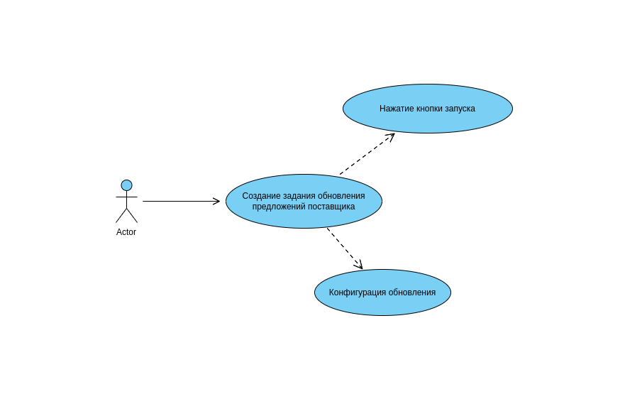

# Пользовательский сценарии 2001

<table>
    <tr>
        <td>Действующие лица</td>
        <td>Администратор, Система</td>
    </tr>
    <tr>
        <td>Цели</td>
        <td>
        Администратор: 
             Зайти в админку, запустить обновление предложений поставщика, получить уведомление.
          
        Система: 
             Выполнить прасинг и обновление в асинхронном режиме и по окончании сформировать уведомление.
        </td>
    </tr>
    <tr>
        <td>Успешный сценарий</td>
        <td>
1. Администратор заходит в админ панель через веб браузер 
2. Администратор в панели фильтрации выбирает нужного поставщика и категорию предложений, нажимает кнопку запуска 
3. Система формирует сообщение и отправляет в очередь 
4. Консумер отвечающий за парсинг забирает сообщение из очереди и запускает процесс парсинга 
5. Перед началом парсинга в БД записывается история о начале парсинга 
6. По завершению парсинга формируются ресурсы в виде файлов xml и сохраняются в общем файловом хранилище, обновляется запись в БД. 
7. Система формирует сообщение для обновления спарсенных товаров и отправляет в очередь. 
8. Консумер отвечающий за обновление предложений забирает сообщение из очереди и запускает процесс обновления через переданный ID сформированного при парсинге файла 
9. По завершению обновления, запись в БД сделанная на 5 шаге помечается как завершенная и формируется сообщение для оповещения пользоватея 
10. Консумер отвечающий за оповещение забирает сообщение из очереди и запускает процесс передачи оповещения во внешний сервис 
11. Администратор получает уведомление о том что парсинг и обновление завершено 

</table>

