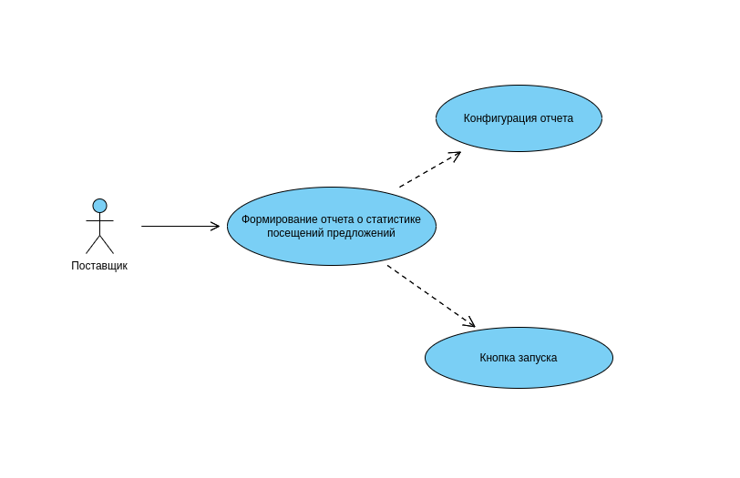

# Пользовательский сценарии 3001

<table>
    <tr>
        <td>Действующие лица</td>
        <td>Поставщик, Система</td>
    </tr>
    <tr>
        <td>Цели</td>
        <td>
        Поставщик: 
             Зайти в личный кабинет и с помощью фильтров сформировать отчет о статистике переходов по его предложениям.
          
        Система: 
             Рассчитать статистические данные и отправить поставщику.
        </td>
    </tr>
    <tr>
        <td>Успешный сценарий</td>
        <td>
1. Поставщик заходит в личный кабинет через веб браузер 
2. Поставщик в панели фильтрации выбирает категорию предложений, временной период и нажимает кнопку запуска 
3. Система формирует сообщение и отправляет в очередь 
4. Консумер отвечающий за формирование отчетов забирает сообщение из очереди и запускает процесс сбора данных 
5. Перед началом парсинга в БД записывается история о начале задания 
6. По завершению сбора данных и их обработке формируются ресурсы в виде файлов pdf и xml и сохраняются в общем файловом хранилище, обновляется запись в БД. 
9. Система формирует сообщение для оповещения поставщика, с ссылкой на pdf файл 
10. Консумер отвечающий за оповещение забирает сообщение из очереди и запускает процесс передачи оповещения во внешний сервис 
11. Поставщик получает уведомление о том что формирование отчета завершено и получает ссылку на pdf файл 
12. Поставщик также может посмотреть данные последнего отчета в личном кабинете за счет сохраненного xml файла, который привязан к его аккаунту 

</table>

